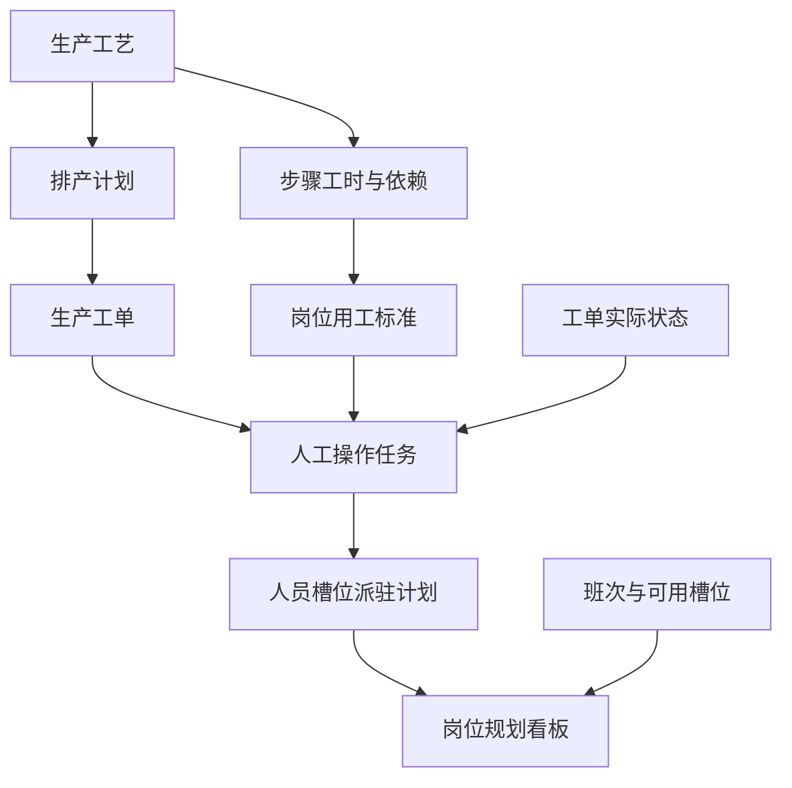
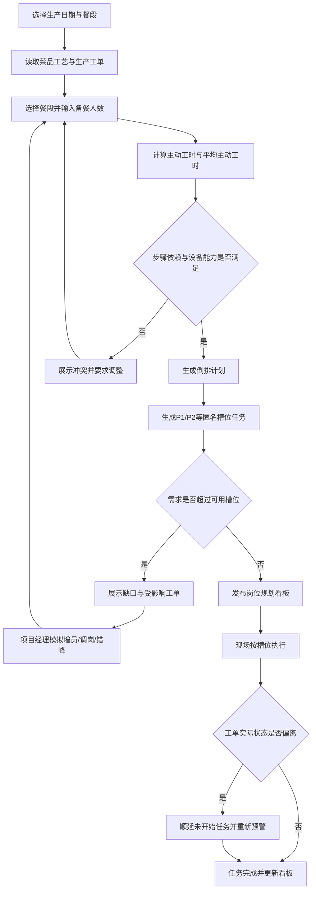

# 人机协同岗位规划与人员预控 PRD

## 背景与问题

当前生产管理已经具备餐品工艺、生产排产和生产工单。40道菜的示例文件进一步给出了焯烫、拉油、称量分装的步骤工时，以及4名备餐人员的倒排安排。

当前最需要解决的不是“系统把某张工单派给某个具体员工”，而是：

- 根据当天菜品、工单和所选餐段，提前计算备餐岗位什么时候开始工作。
- 明确每个时间段需要哪些岗位、多少个匿名人员槽位、每个槽位做什么。
- 用人员需求和现有班次人数对比，提前发现缺人、峰值拥堵和时间冲突。
- 让项目经理可以在看板上确认每个匿名人员槽位对应的实际人员，但看板不展示姓名。

本PRD的业务样本来自《清华项目40道菜单+预处理+排产+产能测算_20260811.xlsx》。其中40道菜的主动预处理工时合计为188分钟，4名备餐人员的平均主动工时为47分钟；文件同时给出了预处理分工和烹饪排产样例。该文件作为首批规则和数据样本，不直接等同于通用系统算法。

## 目标

### 产品目标

1. 将菜品步骤工时、生产工单、餐段开餐时间和备餐人数转换为可执行的岗位时间计划。
2. 从餐段配置拉取开餐时间，并由系统计算设备线到位、烹饪开始和备餐开始等所有派生时间。
3. 以“人员槽位标记”展示人员派驻计划，不在公共看板展示具体姓名。
4. 按分钟生成任务、按15分钟汇总看板，并同时计算人时负荷和瞬时峰值人数。
5. 在生产前提供缺人预警，在生产中根据工单实际状态滚动修正预测。

### 成功标准

- 管理人员能回答“何时、何地、需要什么岗位、需要几个槽位、持续多久”。
- 对于一个确定的开餐计划，系统能生成备餐开始时间和完整岗位看板。
- 看板中的P1、P2等槽位可以被项目经理映射到实际人员，但未授权用户看不到姓名。
- 当人数、开餐时间、设备数量或菜品数量变化时，系统可以重新计算，并指出缺口和受影响工单。

## 用户与场景

### 目标用户

- **项目经理/生产计划员**：配置备餐人数、查看倒排结果、确认岗位规划和人员槽位映射。
- **现场班组长**：查看当日看板、处理缺人、调岗和生产延误。
- **现场备餐/烹饪人员**：按人员槽位标记查看当前任务和下一项任务。
- **工艺管理员**：维护菜品步骤工时、等待时间、设备和工序依赖。

### 主要场景

1. **餐前倒排**：项目经理选择午餐餐段、输入备餐人数4人，系统从餐段配置取得开餐时间，根据40道菜的工时计算设备线到位、烹饪开始、备餐开始，并生成P1-P4看板。
2. **人员预控**：计划员发现09:25—09:40需要4个转运/交接槽位，但当前可用槽位只有3个，系统标记缺口并展示受影响的工单或设备线。
3. **生产中修正**：称量或焯烫实际延迟，系统顺延未开始任务，检查P1-P4的后续冲突并重新提示风险。

## 核心对象与数据模型

### 对象关系



### 生产工艺

定义“菜品怎么生产”，不定义某天由谁执行。

关键字段：

| 字段 | 类型 | 说明 |
|---|---|---|
| dishId | 标识 | 菜品ID |
| dishName | 文本 | 菜品名称 |
| processSteps | 数组 | 菜品步骤 |
| waitMinutes | 数值 | 等待时间，如腌制等待；不计入主动工时，但影响依赖 |
| activeMinutes | 数值 | 主动操作时间 |
| deviceType | 枚举 | 自动炒菜机、自动蒸烤箱等 |
| batchCapacity | 数值 | 每锅/每盘容量 |
| cookingMinutes | 数值 | 烹饪时长 |

40道菜的预处理主动工时计算口径为：

```text
主动工时 = 焯烫工时 + 拉油工时 + 称量分装工时
```

腌制等待不计入主动工时，但必须在倒排时作为前置等待条件。

### 生产工单

定义“这一批菜今天如何流转和操作”，沿用现有工单状态，不由本系统另造一套工单状态。

工单操作阶段：

```text
称重 → 加料 → 摆盆 → 烹饪 → 出餐 → 取餐
```

关键字段：

| 字段 | 类型 | 说明 |
|---|---|---|
| workOrderId | 标识 | 工单ID |
| dishId | 标识 | 关联菜品 |
| productionDate | 日期 | 生产日期 |
| quantity | 数值 | 份数/盆数/锅数，按工单口径保存 |
| deviceId | 标识 | 实际设备 |
| plannedStartAt | 时间 | 计划开始时间 |
| plannedServeAt | 时间 | 计划出餐时间 |
| actualStatus | 枚举 | 现有工单状态 |
| actualStartAt/actualEndAt | 时间 | 实际执行时间 |

现有状态包括：未开始、待称重、称重中、待加料、加料中、称重加料完成、待摆盆、摆盆中、摆盆完成、待烹饪、预热中、烹饪中、烹饪完成、开始出餐、出餐完成、取餐中、取餐完成、已作废。

### 岗位用工标准

定义“每个工单操作步骤需要怎样的人力”，独立于菜品工艺和具体工单。

关键字段：

| 字段 | 类型 | 说明 |
|---|---|---|
| laborRuleId | 标识 | 规则ID |
| workOrderStage | 枚举 | 称重、加料、摆盆、烹饪、出餐、取餐 |
| operationName | 文本 | 如焯烫、拉油、按锅称量、装盘转运 |
| role | 文本 | 岗位名称，如焯烫岗、称量分装岗 |
| skillTags | 数组 | 所需技能 |
| workloadUnit | 枚举 | 菜品、锅、盆、批次、kg、设备 |
| fixedMinutes | 数值 | 固定准备或收尾时长 |
| unitMinutes | 数值 | 每个工作量单位的操作时长 |
| minSlots | 数值 | 最少人员槽位数 |
| maxSlots | 数值 | 最大协作槽位数 |
| canParallel | 布尔 | 是否允许并行 |
| locationId | 标识 | 操作区域/工位 |
| predecessor | 标识 | 前置操作 |
| deadlineNode | 标识 | 最晚完成节点 |

### 人员槽位

人员槽位是匿名的、可流动的人员标识，不等同于固定岗位，也不等同于实际员工姓名。

推荐格式：`P1`、`P2`、`P3`、`P4`，或带业务前缀的`备餐-01`、`备餐-02`。

关键字段：

| 字段 | 类型 | 说明 |
|---|---|---|
| slotId | 标识 | 如P1 |
| displayTag | 文本 | 看板展示标记 |
| color | 色值 | 看板视觉区分 |
| skillTags | 数组 | 该槽位可承担的技能 |
| availableWindows | 数组 | 可用时间段 |
| hiddenPersonId | 标识，可空 | 项目经理维护的实际人员映射；公共看板不展示 |

### 人工操作任务

由生产工单、岗位用工标准和排产计划共同生成。

关键字段：

| 字段 | 类型 | 说明 |
|---|---|---|
| taskId | 标识 | 任务ID |
| workOrderId | 标识 | 关联工单 |
| stage | 枚举 | 所属工单阶段 |
| operationName | 文本 | 具体操作 |
| plannedStartAt | 时间 | 计划开始 |
| plannedEndAt | 时间 | 计划结束 |
| requiredSlots | 数值 | 需要的槽位数 |
| assignedSlotIds | 数组 | 已分配的匿名槽位 |
| status | 枚举 | 待规划、已规划、执行中、已完成、已顺延、已取消、缺口 |
| sourceType | 枚举 | 工艺计算、工单规则、人工调整 |

## 范围

### 本次包含

- 菜品步骤工时录入与主动工时计算。
- 餐段选择和开餐时间自动拉取。
- 备餐人数输入和平均主动工时计算。
- 以餐段开餐时间为终点、由系统计算中间节点的倒排计划。
- 每个操作步骤的岗位、区域、时间段和槽位需求。
- P1/P2等匿名人员槽位的创建、区分和流动安排。
- 岗位规划看板和人员槽位时间轴。
- 人时负荷、平均需求、瞬时峰值、可用人数和缺口展示。
- 工单状态变化后的未开始任务顺延和风险刷新。
- 项目经理将匿名槽位映射到实际人员的后台能力。

### 不在本次范围

- 不在公共看板展示员工姓名。
- 不做工资、绩效、考勤结算。
- 不要求第一期自动选择具体员工；第一期采用槽位规划和项目经理确认。
- 不改变现有生产工单状态定义。
- 不把生产工艺和生产工单合并为同一个对象。
- 不在第一期自动优化40道菜的菜单组合或营养结构。
- 不默认所有操作都必须实时连接设备；未联网设备允许人工更新状态。

## 用户故事

1. 作为项目经理，我希望选择餐段并输入备餐人数，从而得到系统自动计算的备餐开始时间和完整派驻看板。
2. 作为项目经理，我希望看到P1-P4这类匿名槽位，而不是员工姓名，从而先确认岗位规划，再单独维护人员映射。
3. 作为生产计划员，我希望按时间段看到岗位需求与可用槽位差异，从而提前发现缺人。
4. 作为班组长，我希望知道每个槽位在当前时段做什么、下一项做什么，从而组织现场流动。
5. 作为工艺管理员，我希望维护每道菜各步骤工时和等待条件，从而让倒排计算有数据依据。
6. 作为现场人员，我希望根据槽位标记看到当前操作区域和任务，从而不依赖公共看板上的姓名。

## 体验与内容要求

### 页面结构

```text
生产管理
├── 生产工艺
├── 生产工单
├── 岗位用工标准
├── 人员槽位配置
└── 岗位规划看板
```

### 岗位规划看板

看板顶部展示：

```text
餐段：午餐    开餐时间：11:00（自动拉取）    备餐人数：4人
总主动工时 188分钟    平均主动工时 47分钟/人
备餐开始 08:15（系统计算）    设备线到位 09:40（系统计算）
```

看板主体采用“时间 × 人员槽位”的时间轴：

```text
┌────────────┬──────────────┬──────────────┬──────────────┬──────────────┐
│ 时间        │ P1           │ P2           │ P3           │ P4           │
├────────────┼──────────────┼──────────────┼──────────────┼──────────────┤
│ 08:15-08:35│ 肉禽腌制     │ 水产称量     │ 焯烫         │ 称量分装     │
│ 08:35-09:05│ 拉油/预炸     │ 水产拉油     │ 焯烫         │ 分装装盘     │
│ 09:05-09:25│ 肉禽复核     │ 水产复核     │ 焯烫复核     │ 标签复核     │
│ 09:25-09:40│ 炒菜机1转运  │ 炒菜机2转运  │ 蒸烤盘转运   │ 设备线转运   │
│ 09:40-10:00│ 设备交接     │ 设备交接     │ 设备交接     │ 设备交接     │
└────────────┴──────────────┴──────────────┴──────────────┴──────────────┘
```

每张任务卡展示：槽位标记、时间、操作、岗位、区域、关联菜品和状态；不展示姓名。

### 风险表达

- 绿色：需求满足。
- 黄色：槽位紧张或存在时间缓冲不足。
- 红色：缺口、无法按时完成或存在任务冲突。
- 灰色：等待状态，不占用主动工时。

### 时间精度

- 底层任务计算精确到分钟。
- 看板汇总默认按15分钟展示。
- 峰值和冲突判断使用真实任务起止时间，不使用15分钟平均值替代。

## 功能要求

### 1. 菜品步骤工时与主动工时

**功能描述**：维护每道菜每个步骤的等待时间和主动工时，并计算菜品主动工时与批次总主动工时。

**规则**：

- 焯烫、拉油、称量分装属于主动工时。
- 腌制等待属于等待时间，不计入主动工时，但必须阻止后续依赖步骤提前开始。
- 主动工时计算公式为：`焯烫 + 拉油 + 称量分装`。
- 支持按菜品、锅、盆、批次或kg配置工作量换算。

**状态**：草稿、已生效、已停用、校验失败。

**边界**：步骤时间为空时不可发布；时间为0表示该步骤不需要执行，不应被当成缺失；批次容量为空时不能计算锅次。

### 2. 倒排计划计算

**功能描述**：用户选择餐段并输入备餐人数后，系统从餐段配置拉取开餐时间，结合菜品工艺、生产工单、设备和岗位用工标准，计算所有中间节点并倒推出备餐开始时间。

**用户输入**：餐段、备餐人数。

**系统读取**：餐段开餐时间、菜品工艺、生产工单、设备能力、岗位用工标准和默认缓冲规则。

**系统计算**：烹饪完成时间、烹饪开始时间、设备线到位时间、备餐完成时间、备餐开始时间、各步骤时间段、人员槽位需求和风险状态。以上派生结果默认只读，不能在看板上直接手工修改。

**核心计算**：

```text
总主动工时 = 所有工单主动工时之和
平均主动工时 = 总主动工时 ÷ 备餐人数
设备线到位时间 = 根据生产工单、设备排程和岗位规则计算
备餐完成时间 = 设备线到位时间
备餐开始时间 = 备餐完成时间 - 平均主动工时 - 转运交接缓冲
```

以上为MVP的倒排基线。系统还必须执行步骤依赖检查、设备容量检查和槽位冲突检查；检查不通过时标记“计算存在风险”，不能静默生成看似可执行的计划。需要调整时，应回到餐段、生产工单、工艺或备餐人数等上游数据修改。

**交互**：用户选择餐段并输入备餐人数后点击“生成倒排计划”；系统展示餐段开餐时间、计算摘要、时间轴和风险。用户修改备餐人数或上游排产后可重新计算；餐段开餐时间不可在本模块直接编辑。已确认计划再次计算前必须提示将覆盖未锁定任务。

**状态**：未计算、计算中、计算成功、存在风险、计算失败、已确认、已锁定。

### 3. 人员槽位规划

**功能描述**：创建匿名槽位并在不同时间段分配不同岗位任务，支持流动而不是固定绑定。

**规则**：

- 槽位默认使用P1、P2、P3等编号，也可配置“备餐-01”等显示名称。
- 同一槽位可以在不同时间段承担不同岗位。
- 同一时间段内，槽位不能承担两个重叠任务，除非规则明确允许一人照看多台设备。
- 槽位可配置技能标签和可用时间，用于缺口判断。
- 实际姓名映射为受权限控制的后台信息，不进入公共看板。

**状态**：空闲、已规划、执行中、已完成、不可用、缺口。

**边界**：槽位数小于需求时保留“缺口任务”，不可通过隐藏任务消除缺口；槽位技能不匹配时不得自动视为可用。

### 4. 岗位规划看板

**功能描述**：按时间轴展示每个槽位的任务和岗位需求，并汇总区域、岗位和总人数。

**核心展示**：

- 开餐时间、备餐开始时间、设备线到位时间。
- 总主动工时、平均主动工时、峰值需求、可用槽位、缺口。
- 时间×槽位任务卡。
- 按岗位/区域汇总的需求表。
- 缺口和冲突详情。

**交互**：支持按日期、餐段、区域、岗位、工单和风险筛选；点击任务卡查看步骤、工单、标准工时和计算来源；点击缺口查看受影响工单和建议调整方向。

**状态**：加载中、正常、紧张、缺口、无计划、数据过期。

### 5. 工单状态联动

**功能描述**：使用现有工单实际状态更新人工任务，不改变工单状态本身。

**规则**：

- 工单提前进入下一阶段：提前提醒尚未开始的槽位任务。
- 工单延迟：顺延未开始任务，并检查槽位后续任务冲突。
- 工单作废：取消尚未开始的人工任务，已完成记录保留。
- 进入`摆盆完成`及之后的工单不能直接作废，沿用现有工单规则。
- `预热中`是否出现由设备类型决定，不强制所有工单经过该状态。

### 6. 人员预控与方案模拟

**功能描述**：比较岗位需求和可用槽位，提前发现风险，并支持调整方案的试算。

**可调整输入**：备餐人数。餐段、菜品数量、设备数量和工艺参数在各自的上游模块维护；开餐时间、设备线到位时间、烹饪开始时间、缓冲时间和任务时间段均由系统计算。

**输出**：缺口人数、缺口时段、缺口岗位、受影响工单、预计延误、推荐调整方向。

**推荐调整方向**：增加槽位、调整槽位技能、错峰开始、启用备用设备、延长备餐窗口、调整生产顺序。系统只提供建议，不自动替项目经理执行调班。

## 核心用户动线



## 文案规范

### 产品整体文案

准确、直接、面向现场管理。优先使用“需求、可用、缺口、预计、已确认”等词，避免使用“智能替你决定”这类过度承诺。

### 面向用户的文案

- “平均主动工时：47分钟/人”
- “09:25—09:40需要4个槽位，当前可用3个，缺1个”
- “该缺口可能影响2张工单进入烹饪”
- “重新计算将更新所有未锁定任务，是否继续？”
- “该时间段没有可用槽位，请先增加人员或调整计划”

### 开发字段与用户文案分离

开发字段使用`requiredSlots`、`plannedStartAt`、`activeMinutes`等明确字段；用户界面使用“需求槽位”“计划开始”“主动工时”等中文文案。

## 非功能性需求

- **性能**：单日40道菜、100张以内工单的倒排计算在3秒内完成；看板筛选响应在2秒内完成。
- **权限**：项目经理可维护槽位与姓名映射；计划员可查看和调整计划；现场人员只能查看公共看板和与其槽位相关的任务；姓名映射不得出现在无权限接口或导出文件中。
- **一致性**：重新计算不得覆盖已锁定任务；所有人工调整保留修改人、时间和原因。
- **可追溯**：记录计算版本、规则版本、输入参数、生成时间和手工调整记录。
- **兼容性**：延续现有生产工单页面的状态和字段，不要求第一期接入所有设备。
- **数据安全**：实际姓名与匿名槽位映射单独控制访问；公共看板只存储并展示槽位标记。

## 验收标准

### 产品验收

- 选择午餐餐段、输入4名备餐人员后，系统从餐段配置拉取11:00开餐时间，并自动得到总主动工时、平均主动工时和备餐开始时间。
- 焯烫、拉油、称量分装的工时被计入主动工时；腌制等待不被计入主动工时，但会影响依赖关系。
- 看板能按时间段展示P1-P4的任务、岗位、区域和关联菜品。
- 看板不展示具体员工姓名，但项目经理可以在受控页面维护槽位与姓名映射。
- 当需求槽位大于可用槽位时，系统展示缺口时段、缺口岗位和受影响工单。
- 工单延迟时，未开始任务能顺延并重新计算冲突；已完成任务不被修改。

### 设计验收

- 任务卡能一眼区分不同槽位和风险状态。
- 看板同时表达时间、槽位、岗位、区域和任务内容，不依赖姓名识别。
- 缺口使用明显但克制的风险色；等待时间与主动工作有明确视觉区分。
- 公共看板不出现姓名、手机号或其他个人信息。

### 实现验收

- 工艺、工单、岗位用工标准、人工任务、人员槽位为独立对象。
- 计算结果可追溯到菜品步骤工时、人数输入和关键节点。
- 重新计算不会覆盖锁定任务。
- 对空工时、0工时、缺失批次容量、技能不匹配和时间重叠给出明确错误或风险提示。

### 回归风险

- 现有工单状态和详情页不能因新增人员规划而改变语义。
- 纯机器工序不应被错误计算成人工任务。
- 备用设备启用后，必须同步增加对应设备操作和转运需求。
- 不能用平均人数掩盖瞬时峰值缺口。

## 开放问题

1. 文件中预处理明细主动工时合计为188分钟，但岗位估算为50+48+48+47=193分钟，需确认额外5分钟是否代表交接/缓冲，并在系统中单独建模。
2. 烹饪排产摘要写“操作人员需求2人”，但4人一体化排产中4个槽位分别负责4台炒菜机及兼顾蒸烤换盘，需要确认“最低人数、推荐人数、峰值人数”的口径。
3. 蒸烤箱在不同表中出现“2台”和“1台+1台备用”两种表述，需要确定备用设备启用时的人员计算规则。
4. 设备线到位、烹饪开始和缓冲时间的计算规则是否统一配置在岗位/排产规则中，还是允许按设备类型分别配置；这些属于规则配置，不作为看板输入项。
5. 看板槽位标记最终采用短编号（P1/P2）还是业务编号（备餐-01/备餐-02），以及是否需要颜色、图标或实体标识牌联动。
6. 项目经理确认槽位对应实际人员的页面是否与人员排班系统打通，还是第一期仅在本系统维护映射。
