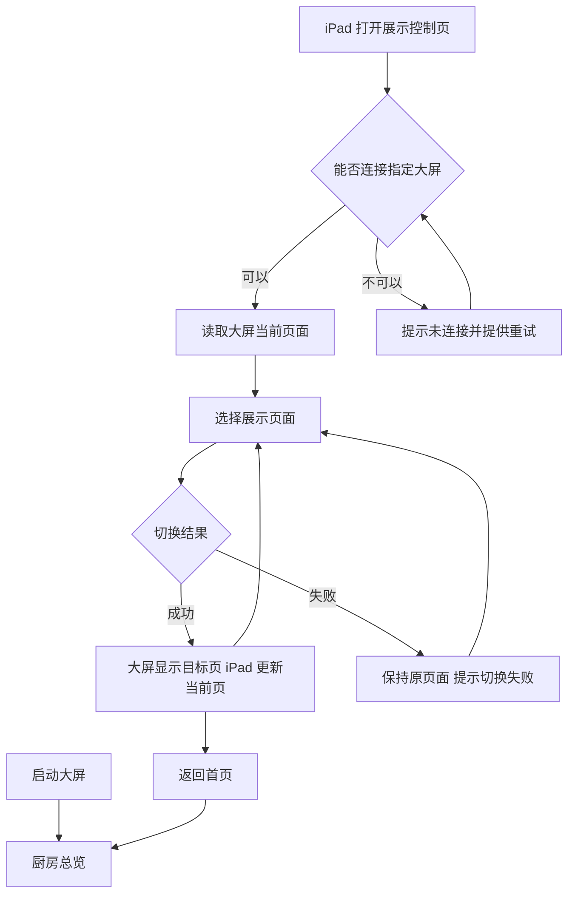

# 客户驾驶舱需求 PRD

版本：V0.1｜日期：2026-09-22｜状态：需求评审稿

> 产品定位：面向客户领导与参观人员的无人智厨展示大屏，通过设备协同示意、烹饪流程、设备能力和行为监控，帮助接待人员讲清无人厨房的组成与价值；由 iPad 控制展示页面切换。
>
> 本文整理已确认方向，并将尚无依据的业务关系、数据能力和实施条件标为待确认。本文不代表现有原型已完成改造，也不代表真实设备、监控或跨设备控制已经接入。

## 文档目录与关联文档

- 本文：客户定制大屏的产品范围、页面要求、业务规则与验收依据。
- 关联原型：`src/prototypes/customer-cockpit-requirements/`，侧栏名称“客户驾驶舱需求”，由“单独展示版”复制。
- 行为监控参考：用户在本次对话提供的完整页面截图，以及关联原型中的 `BehaviorCockpit` 内容。截图用于确定展示模块，用户说明优先于截图示例值。
- 编写模板：`templates/prd.md`。
- 当前关联原型已建立 `.spec/spec.html` 主规格，并以本文和公开行业调研补充内容作为实现依据。外部 Obsidian 文件仍作为需求来源保留，原型实现位于 `src/prototypes/customer-cockpit-requirements/`。

## 背景与问题

公司从事 L4／L5 无人智厨业务，客户希望通过一块非触摸显示屏对领导和参观人员展示厨房能力，并通过 iPad 配合现场讲解切换内容。

当前无法提供真实厨房布局或三维模型；称重量、任务进度、设备实时状态及人工介入次数是否可获取均未确定。客户初步提及炒菜机、机械臂、烤箱、容器和层架，但型号、数量、用途和协作关系尚未确认。

因此，本期以设备与流程的可解释展示为主，厨房总览采用用户已选择的设备协同示意图。行为监控保留用户指定页面，其他食安模块不纳入本期。根据行业公开方案补充一个“运营驾驶舱”子页面，用于展示生产任务、设备状态、用料与出成；这些内容目前只做结构演示，接入条件和统计口径仍需确认。

## 目标与成功标准

| 目标 | 成功标准 |
| --- | --- |
| 让参观者理解厨房组成 | 总览能清晰识别已确认的设备与器具，并读懂其职责；示意布局不冒充现场还原 |
| 让讲解有清晰顺序 | 接待人员能从总览切换至流程、设备能力和行为监控，并随时返回首页 |
| 支持非触摸大屏 | 核心展示过程不依赖触摸大屏或悬停操作 |
| 保证展示信息可信 | 未接入数据不显示为实时数据，未确认能力不作为已交付能力宣传 |
| 适应交付屏幕 | 在双方确认的分辨率和比例下，关键信息完整可读，无裁切、重叠和横向滚动 |

## 用户、角色与场景

| 角色 | 场景与核心任务 |
| --- | --- |
| 客户领导、参观人员 | 观看大屏，认识设备组成、无人烹饪方式及行为识别能力 |
| 接待／讲解人员 | 使用 iPad 切换展示主题，控制讲解顺序，不执行生产操作 |

典型场景：

1. 参观开始：大屏进入厨房总览，讲解人员介绍设备与器具。
2. 运营讲解：通过 iPad 切至运营驾驶舱，说明生产、设备、用料和能耗如何形成运营闭环。
3. 深入讲解：通过 iPad 切至烹饪流程和设备能力，解释不同设备如何配合。
4. 监控展示：切至行为监控，介绍异常分类及抓拍记录；结束后返回总览。

## 范围

### 本次包含

- 五个大屏页面：厨房总览、运营驾驶舱、无人烹饪流程、核心设备与能力、行为监控。
- 厨房总览采用设备协同示意图，不依赖真实三维模型。
- iPad 控制展示页面，大屏展示完整内容；两端页面不要求镜像一致。
- 运营驾驶舱的行业常见内容：生产任务进度、烹饪区设备状态标注、用料／出成、能耗、物料库存、告警与维保提醒。
- 非触摸大屏适配、素材异常和数据缺失状态。
- 行为监控保留“发现人员”异常类别，并纳入全部异常统计。
- 原有生产驾驶舱作为保留优化页：保留生产进度、投料区、烹饪区和出餐区结构，修正演示数据口径并隐藏营养健康、食品安全入口。

### 不在本次范围

- 厨房设备启停、配方修改、任务下发、生产调度、异常处置与工单操作。
- 食安台账、晨检、留样、农残检测、营养健康等独立模块。
- 真实厨房三维建模或数字孪生状态同步。
- 未确认可获取的称重、任务进度、运行状态、人工介入及节省人工等真实量化指标接入；运营驾驶舱只保留明确标注的演示值。
- 原有生产驾驶舱的演示任务、设备状态和时间不代表现场实时接入结果。
- 多场地、多大屏集群管理；原生 iPad App 暂不作为必要交付物。

## 用户故事

1. 作为参观者，我希望一眼看懂厨房由哪些设备组成，从而理解无人智厨的工作方式。
2. 作为讲解人员，我希望在 iPad 上选择展示主题，从而配合现场讲解切换大屏。
3. 作为参观者，我希望了解炒菜机、机械臂和烤箱分别承担什么工作，从而理解自动化能力。
4. 作为讲解人员，我希望展示行为监控分类和抓拍内容，从而说明厨房异常识别能力。
5. 作为客户领导，我希望看到生产、设备、用料和能耗的运营总览，从而判断无人智厨的管理价值。

## 能力与信息架构

| 优先级 | 能力 | 说明 |
| --- | --- | --- |
| 核心 | 厨房总览 | 默认首页，设备协同关系与职责 |
| 核心 | 无人烹饪流程 | 按已核实流程解释加工环节 |
| 核心 | 核心设备与能力 | 图片、名称、用途、已确认能力 |
| 核心 | 行为监控 | 分类统计、抓拍、位置与时间 |
| 核心 | 运营驾驶舱 | 生产任务、设备状态、用料／出成 |
| 核心 | iPad 切页 | 五页直达、当前页反馈、返回首页 |
| 建议，待确认 | 最近一天／一周／一月筛选 | 参考页已有控件；若启用，需真实筛选能力及数据支持 |
| 核心，演示 | 运营数据 | 先展示称重、产量、任务、设备、能耗和运维的结构；数据源确认后替换演示值 |

主流程及异常分支：



## 数据模型

仅定义业务信息，不预设数据库或接口实现。

| 对象 | 主要字段 | 内容规则 |
| --- | --- | --- |
| 展示项目 | 项目名称、客户名称、品牌素材 | 未确认客户信息不沿用参考页的“江南校区”作为正式信息 |
| 设备／器具 | 名称、类别、图片、用途、能力说明、确认状态 | 容器与层架按器具展示，不默认计为联网设备；数量未知时不显示数量 |
| 协作关系 | 起点、终点、关系说明、确认状态 | 未确认关系仅用于评审示意，正式交付前核实 |
| 生产环节 | 名称、参与设备、输入／输出说明、顺序或分支 | 不自动推断炒菜机与烤箱串行工作 |
| 异常事件 | 事件标识、异常类型、发生时间、区域、摄像头、抓拍图 | 类型包括未戴口罩、未戴帽子、发现老鼠、发现抽烟、发现人员 |
| 异常汇总 | 统计周期、全部异常、各分类数量、更新时间、数据模式 | 统计与列表使用一致周期；缺失不等于零 |
| 运营指标 | 计划产量、完成量、任务进度、设备状态、用料／出成 | 首版为演示数据；缺少数据源时显示待接入，不填充为实时值 |
| 展示状态 | 当前页面、连接状态、切换结果 | iPad 高亮以实际展示结果为准，不仅根据点击更新 |

## 业务规则

1. 默认首页为厨房总览；讲解人员手动切页。自动轮播和空闲自动返回尚未确认，本期不默认开启。
2. iPad 仅控制展示，不提供任何厨房设备操作入口。
3. 五类候选设备与器具为炒菜机、机械臂、烤箱、容器、层架；不将候选清单写成已部署清单。
4. “中央机械臂＋周边设备”是待评审的布局建议，不等于已经确认机械臂负责所有设备间搬运。
5. 炒菜机与烤箱先作为不同加工路径说明；最终连接关系按实际方案确认。
6. 无真实布局时页面标注“设备协同示意”；用于说明协作的动效不暗示实时作业状态。
7. “发现人员”属于异常，必须计入全部异常。具体检测区域与识别条件由监控系统定义，尚待确认，不自行增加“非法闯入”等业务判断。
8. 全部异常的事件去重方式与多标签归类方式待监控方确认。建议按唯一事件计总数；若每个事件只属于一类，全部异常应等于分类之和；若同一事件可多标签，则需明确分类与总量不可直接相加。
9. 参考页分类数为 19、102、0、2、37，合计 160，而总量显示 158；在去重口径确认前，不把这些示例数作为正确业务样本。
10. 演示数据显式标注“演示数据”；无数据源时不能显示“实时连接”“设备运行中”等无依据状态。显示端连接正常不等于厨房设备正常。
11. 本期行为监控展示以抓拍事件为基准；截图不等于视频直播需求，不默认增加直播或录像回放。
12. 运营驾驶舱数据全部显式标注为演示；未接入的称重、设备物联、能源计量、库存或维保系统不得显示为实时数据。
13. 运营驾驶舱只展示运营能力，不承担设备启停、任务下发、配方修改或异常处置操作。

## 权限与作用范围

建议首期一个项目、一块大屏、一个有效控制端。仅授权讲解端可以控制对应大屏；接入和授权方式由技术方案确定。未授权或目标大屏未连接时，禁用切页并说明原因。多控制端冲突处理不默认纳入首期，若客户需要多人同时控制须另行明确。

## 状态、异常与边界

| 场景 | 大屏表现 | iPad 表现 |
| --- | --- | --- |
| 正常连接 | 展示当前页 | 高亮当前页，允许切换 |
| 页面切换中 | 保持原内容直至目标内容可展示 | 显示切换中，避免重复提交 |
| 切换成功 | 显示目标页 | 收到结果后更新高亮 |
| 控制连接中断 | 保留最后成功展示的内容 | 显示未连接，提供重试，不虚报成功 |
| 重连成功 | 保持当前展示 | 读取大屏现状，不覆盖为 iPad 的旧页面 |
| 图片加载失败 | 保留名称和文字说明，显示“图片暂不可用” | 仍可切换其他页 |
| 监控数据加载中 | 模块内显示加载提示 | 不阻塞其他页面切换 |
| 监控无事件 | 显示“所选时段暂无异常记录” | 可切换周期（如启用） |
| 监控未接入 | 显示“监控数据暂未接入”，或展示明确标注的演示内容 | 不提供无效筛选 |
| 监控获取失败 | 有缓存则保留并标明更新时间；无缓存显示获取失败 | 提供重试反馈 |
| 数据字段缺失 | 数值用“—”，不填零；缺图保留事件其他信息 | 不影响导航 |

## 字段、内容与交互要求

### 1. 厨房总览

- 触发：大屏启动，或讲解人员选择“厨房总览”。
- 顶部：产品标题、已确认的客户／项目名称、当前页面名称。
- 主视觉：设备协同示意图；拟以机械臂居中，炒菜机和烤箱为加工节点，容器和层架展示承载与暂存关系。
- 每个节点显示名称和一句职责；图片可用已授权产品图或清楚标注的示意图。
- 连线仅表达已确认关系；评审阶段假设关系需要标注，不作为现场事实。
- 不强制加入实时指标、设备数量、运行状态或产能数字。
- 不要求在大屏点击节点；首页应无需操作即可理解。

布局草案（关系待确认，不代表现场位置）：

```text
┌─────────────────────────────────────────┐
│ 无人智厨展示大屏             客户／项目名称 │
├─────────────────────────────────────────┤
│                厨房总览                  │
│                                         │
│      炒菜机                  烤箱        │
│                 机械臂                  │
│      容器                    层架        │
│                                         │
│ 设备协同示意 · 设备名称与职责说明          │
├─────────────────────────────────────────┤
│ 厨房总览｜烹饪流程｜设备与能力｜行为监控     │
└─────────────────────────────────────────┘
```

### 2. 运营驾驶舱

- 触发：iPad 选择该页，或从底部展示导航进入。
- 目的：面向客户领导快速说明无人智厨的运营管理能力，不替代设备控制台。
- 顶部指标：今日计划产量、已完成量、任务完成率、加工设备数、待处理任务、设备告警；均为演示字段，接入后替换。
- 生产任务进度：按任务展示参与设备、状态、进度条和备注；不把演示进度写成现场任务。
- 生产状态现场区：统一展示投料区、烹饪区、出餐区；放大烹饪区的无人厨房画面，明确标注炒菜机／烤箱状态，并展示入口状态和出口菜品队列。
- 独立设备运行状态模块删除；设备信息只在烹饪区画面中以设备标注形式呈现，容器／层架不默认联网。
- 用料与出成：展示主料用量、配料投放、目标／实际偏差、出成率；“设备具有称重能力”和“系统可读取称重数据”分开确认。
- 能源消耗：预留电、水、气分项统计与峰值时段；只有对应计量数据接入后才显示实际数值。
- 图表：用生产完成趋势折线图和计划／投料／出成对比柱状图承载数据，避免只展示数字卡片。
- 页面底部标注“行业调研归纳”和“当前为结构演示”，避免参观者将示例数理解为客户现场实时数据。

### 3. 无人烹饪流程

- 触发：iPad 选择该页。
- 目的：解释生产步骤，区别于首页的设备组成介绍。
- 每个环节展示名称、参与设备、负责事项及输入／输出说明。
- 可用一条已确认的代表性菜品流程展开；当前没有菜品和流程资料，先作为内容待补充项。
- 不凭空增加自动备料、精准投料、自动清洗等能力；人工参与环节如确有需要，应如实保留。
- 不显示虚构的任务百分比、当前批次或剩余时间。说明性动画标注为流程演示。

### 4. 核心设备与能力

- 触发：iPad 选择该页。
- 展示候选设备与器具的名称、图片、用途及经确认的能力，具体型号与数量可缺省。
- 区分“设备具有称重能力”和“系统可读取称重数据”，两者不能互相推导。
- 首版优先一页完整展示；如内容超出一屏，应压缩文字或经确认后分页，避免增加未经约定的控制复杂度。
- 视频为可选素材，有真实且可用的素材后再定义播放／暂停控制；不是首版必要条件。

### 5. 行为监控

- 触发：iPad 选择该页。
- 复用用户截图的核心结构：项目标识、异常分类统计、抓拍卡片网格。
- 分类：全部异常、未佩戴口罩、未佩戴帽子、发现老鼠、发现抽烟、发现人员。
- 卡片：事件类型、发生时间、区域／摄像头信息、抓拍图、异常标签。
- 推荐按发生时间倒序呈现；参考布局为桌面两行四列，最终数量以目标屏幕可读性为准。
- 页面展示最近事件摘要，不要求展示全部历史；更多事件翻页或自动滚动未纳入已确认范围。
- 若保留最近一天／一周／一月筛选，建议由 iPad 操作，统计和卡片同时更新；周期定义是自然日还是滚动时间窗待确认。
- 相对时间与绝对时间需一致，不能静态写死“2 分钟前”。
- 复用行为监控并不意味着保留截图中的食品安全、营养健康等其他导航入口。

### 6. iPad 展示控制

- 建议使用浏览器打开独立控制页；不要求与大屏显示相同画面，具体部署方式待技术核实。
- 必备内容：目标大屏名称、连接状态、五个页面按钮、当前页状态、返回首页。
- 点击当前页不重复加载；切换失败保留原页并提示重试。
- 若启用监控周期筛选，仅在行为监控控制区展示。
- 上一页／下一页属于可选快捷方式，不是五页直达之外的必要能力。

### 内容与文案

- 以简短中文名称和明确职责说明为主，适合远距离观看；长说明放在设备页而非挤入总览。
- 页面使用对外展示语言，不展示接口名、内部字段或开发状态码。
- 正式客户名称、品牌标识、设备能力和图片均需确认；L4／L5 为用户提供的公司业务背景，不自行补充等级认证或标准符合性声明。
- 已知为演示的内容保留必要标识；未确认素材仅进入评审稿，不静默进入正式客户展示。

## 非功能要求

- 适配：优先横屏；最终屏幕比例、分辨率、物理尺寸和观看距离待确认。16:9 可作为设计草案基准，不能据此宣称所有比例均已适配。
- 可读性：不得简单拉伸导致图片变形或文字过小；关键信息不依赖悬停、颜色单独编码或滚动查找。
- 稳定性：持续展示期间切页不白屏；长时间运行验收时长与切页延迟目标需结合交付设备商定。
- 兼容性：确认实际 iPad 型号、系统、浏览器以及大屏播放终端后验收，不预设所有设备均支持。
- 网络：核实两端网络连通条件及断网后的可用范围；不预设必须公网或保证完全离线可用。
- 数据与素材：限定展示客户授权的监控画面；人员抓拍是否需遮挡、保存多久，沿用客户监控系统要求并在交付前确认，不新增无必要的数据采集。

## 验收标准与来源追溯

| 编号 | 验收标准 | 来源 |
| --- | --- | --- |
| AC01 | 五个展示页面可到达，默认总览；食品安全、营养健康不作为本期页面保留 | S1、S2、S6 |
| AC02 | iPad 切页后大屏实际变化，iPad 当前页与大屏一致；仅同浏览器模拟不算跨设备联动验收通过 | S1 |
| AC03 | 非触摸大屏无需触摸操作即可完成整个参观展示过程 | S1 |
| AC04 | 总览为设备协同示意，不要求真实三维模型；候选清单与已确认清单有明确区别 | S3、S4 |
| AC05 | 不存在未经确认的实时称重、任务进度、运行状态与人工介入数字 | S1 |
| AC06 | 行为监控包含五类异常；发现人员计入全部异常；统计可按确认后的去重规则复算 | S2 |
| AC07 | 抓拍类型、时间、位置可读；缺图、空数据和加载失败时页面仍可用 | S2、建议规则 |
| AC08 | 演示数据明确标识，演示时间与数量不伪装为真实动态数据 | S1、S5 |
| AC09 | 断开控制连接后不虚报切页成功；重连后以大屏当前页同步 | 建议规则 |
| AC10 | 在实际交付屏幕和 iPad 上检查文字、素材和操作，无明显裁切、重叠与变形 | S1 |
| AC11 | 烹饪流程与设备能力经业务方核实，不将炒菜机与烤箱强制串行，不将示意搬运关系写成已实现能力 | S4、待确认事项 |
| AC12 | 运营驾驶舱包含生产任务、烹饪区设备标注、用料／出成；独立设备运行状态模块不展示，所有未接入数据明确标注为演示或待接入 | S6、建议规则 |
| AC13 | 保留优化页可展示生产进度、投料、烹饪和出餐四个区域；任务统计口径自洽并明确标注演示数据；不显示营养健康与食品安全入口 | S1、S5、用户补充 |

产品验收：核对五页内容、业务口径、数据模式与 iPad 展示控制边界。

设计验收：拟沿用现有深蓝与青色风格；正式视觉基底后续确认。重点检查观看距离下可读性、页面主次和监控图片清晰度。

实现验收：在真实大屏播放终端与 iPad 上验证页面切换及异常恢复；监控接入验收与展示控制验收分开，不能用演示数据替代数据接入结果。

回归风险：只在“客户驾驶舱需求”副本实施后续改造；不改变原“单独展示版”及其他原型。

来源索引：

- S1：本次对话中用户对客户领导与参观人员、非触摸屏、iPad 切页及数据不确定性的说明。
- S2：用户指定的行为监控截图，并明确“发现人员算异常”。
- S3：用户选择“设备协同示意图”，无法提供真实厨房布局。
- S4：用户提供的候选清单：“可能有炒菜机、机械臂、烤箱、容器、层架等”。
- S5：关联原型 `src/prototypes/customer-cockpit-requirements/index.tsx` 中的行为监控示例及静态数据；它仅用于识别复用结构与现存口径问题。
- S6：本次公开行业调研归纳：德玛仕智慧交互页的智慧数据大屏、后厨行为监控与任务进度；观麦中央厨房的生产过程报表、出成率与物料损耗；启赋餐饮 MES 的生产排程、设备／库存协同、成本与经营预警；满客宝运维可视化页的设备、能耗与运营看板。调研只用于补充常见模块，不证明本项目已有对应数据接入。
- 建议规则：本 PRD 补充的交互和验收建议，不等同于客户已确认要求。

## 风险与依赖

| 风险／依赖 | 影响与处理 |
| --- | --- |
| 设备与流程尚未核实 | 可以先评审结构，正式展示前必须确认能力与连接关系 |
| 行为监控接口尚未确认 | 先明确演示模式；真实接入的接口、分类、时间和去重规则另行核实 |
| iPad 与大屏网络条件未知 | 影响跨设备控制交付，需现场技术核实，不能把“投屏”与“独立控制”混作同一验收项 |
| 缺少设备素材 | 可用标注清楚的示意素材评审，正式素材需客户或公司确认 |
| 观看尺寸和距离未知 | 无法最终确定字号、卡片数和排版密度 |

## 开放问题

| 问题 | 当前处理 | 建议确认方 |
| --- | --- | --- |
| 实际设备型号、数量、容器及层架用途是什么？ | 五类仅列为候选，不填数量和型号 | 业务／客户 |
| 机械臂搬运哪些对象、连接哪些设备？ | 中央布局为建议，协同线不作为现场事实 | 产品／设备团队 |
| 一条真实生产流程如何运行？ | 流程页保留内容结构，具体环节待补充 | 厨房业务／设备团队 |
| 行为监控提供抓拍还是另有视频需求？是否能接入？ | 首期按抓拍事件设计；未接入时明确演示 | 监控系统方 |
| 全部异常如何去重？“发现人员”的检测条件是什么？ | 已确认其为异常，具体事件口径待补充 | 客户／监控系统方 |
| 是否保留监控周期筛选？周期如何定义？ | 作为建议功能，不把静态按钮视为已支持 | 客户／监控系统方 |
| 屏幕、播放终端、iPad 和网络配置是什么？ | 草案按横屏及单控制端考虑 | 客户／实施团队 |
| 品牌名称、设备图片、正式视觉基底是什么？ | 拟沿用现有风格，正式素材待确认 | 业务／设计 |

上述问题不阻止本 PRD 用于需求评审，但相关条目确认前不得作为已确定的开发承诺或客户现场事实。
