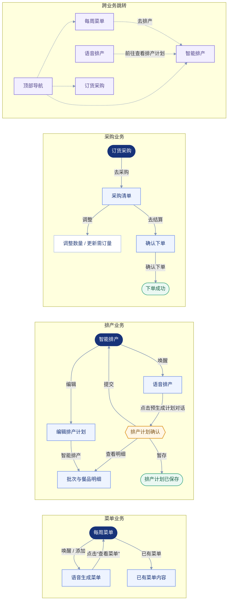

# 智能体页面流程图

> 基于当前原型页面与实际点击交互整理。

## 关键交互说明

- 每周菜单页面：每周菜单生成完成后，点击“查看菜单”返回每周菜单页面；已有菜单入口进入对应的菜单内容。
- 语音排产页面：点击“已预生成排产计划，请查看确认”才弹出“排产计划确认”；点击“前往查看排产计划”直接进入“智能排产”。
- 排产确认页：可查看/收起批次明细，可选择覆盖或保留已有计划，暂存后进入已保存状态，提交后进入智能排产。
- 采购流程：订货采购 → 采购清单 → 确认下单 → 下单成功；采购清单和确认下单均支持返回上一步修改。
- 页面辅助跳转：顶部导航可在菜单、排产、采购三个业务主页面之间直接切换；每周菜单中的“去排产”进入智能排产；排产确认中的“前往查看排产计划”进入智能排产。
